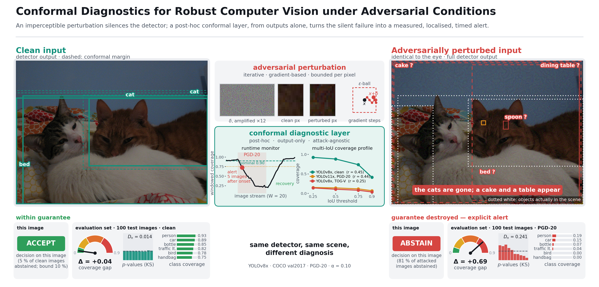
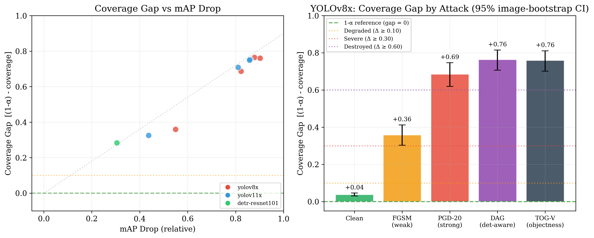
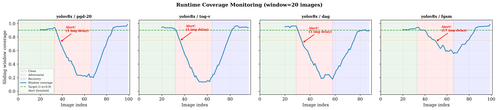
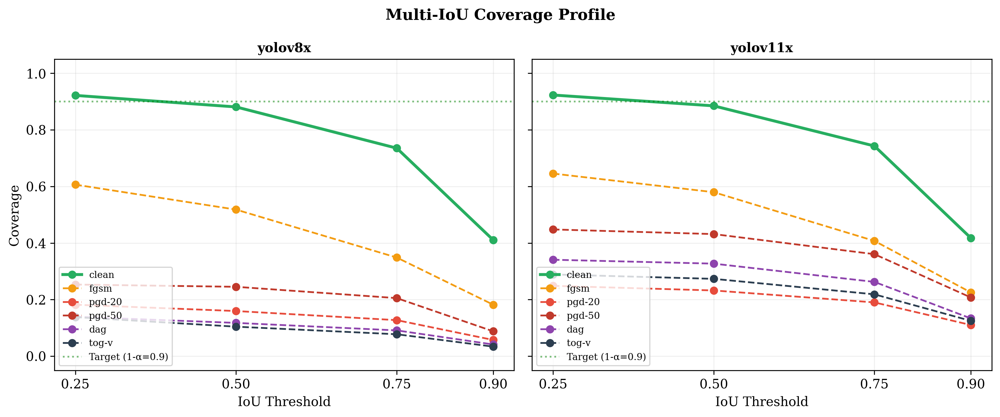
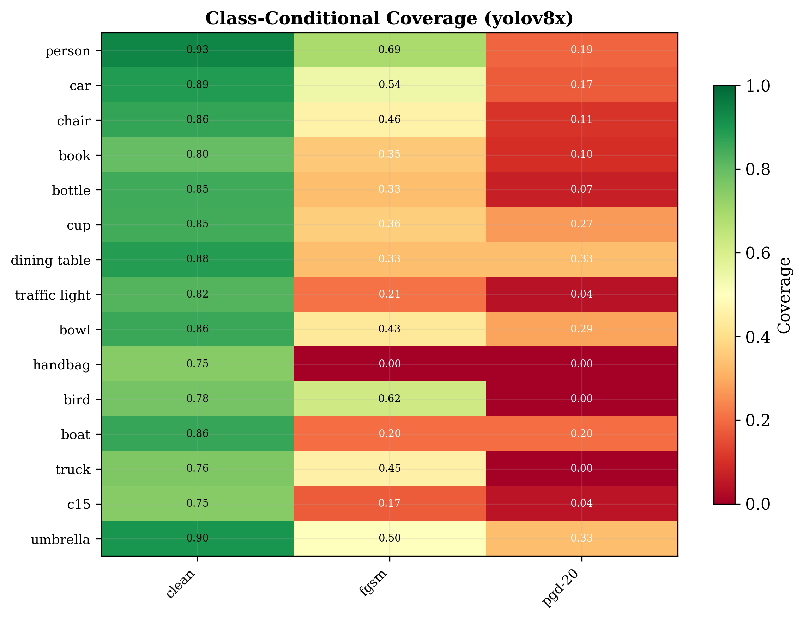
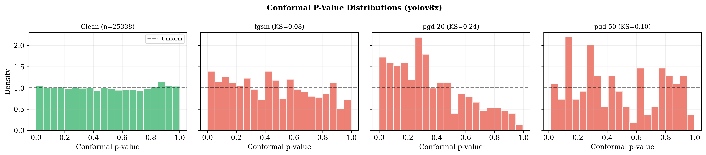
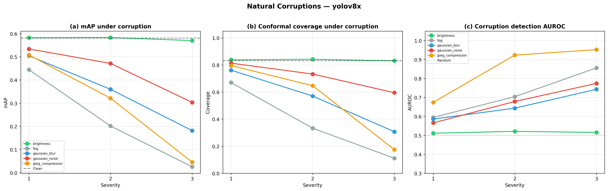

# Conformal Diagnostics for Object Detection under Adversarial Conditions

Code, stored results and reproduction scripts for

> F. Amato, E. Cirillo, A. Moccardi, M. Pelosi — *Conformal Diagnostics for Robust Computer Vision under Adversarial Conditions*, Image and Vision Computing (revised version v8, September 2026).

The repository implements a **post-hoc, output-only** monitoring layer for object detectors built on split conformal prediction (CP), and the experiments that evaluate it on COCO val2017 with four detectors (YOLOv8x, YOLOv11x, RT-DETR-L, DETR-R101), four gradient attacks plus APGD (eleven model–attack pairs, all suppression-type and non-adaptive) and five natural corruptions.

> **Revision note.** The calibrator shipped with the submitted version put every raw detection into the calibration set, which pinned the conformal confidence threshold at τ = 0 (filter inactive). This is fixed in `src/calibration/adaptive_conformal.py` (calibration on matched true positives only, Eq. 11 of the paper). All tables of the revised paper are regenerated from the stored predictions by the scripts in `scripts/rebuttal/`; see [RUNBOOK.md](RUNBOOK.md) for the commands and [Section 6](#6-changelog-of-the-revision) for what changed. The manuscript is `paper/paper_revision_v8_clean.tex` (marked copy: `paper_revision_v8_marked.tex`); the response letters are `paper/Response_to_Reviewer_1_v8.docx` and `Response_to_Reviewer_2_v8.docx`.

---

## Graphical abstract



One real test image (COCO val2017 #551815) seen by YOLOv8x before and after the PGD-20 attack of the experiments, the perturbation that was applied, and the conformal diagnostic layer: runtime monitor (alert 5 images after onset, Table 9), multi-IoU coverage profile (Table 12), coverage gap (Table 5), conformal *p*-values (Table 13) and class-wise coverage (Table 11). Regenerate with `python paper/graphical_abstract_v3.py` from a folder `ga/` holding `results/revision/ga_samples2.json`, `ga_diagnostics.json`, `ga2_clean_0.png` and `ga2_pgd-20_adv_0.png`.

## 1. What the paper shows

1. **CP cannot restore coverage under attack (Recall Ceiling, Proposition 2).** Any post-hoc procedure can only keep a subset of the detector's output; objects the detector never proposed are unrecoverable. With the filter active, recalibrating the threshold on the attacked data itself recovers 0.6–2.7 coverage points in each of the eleven model–attack pairs, never approaching the nominal 0.90 (Table 6).
2. **What CP *can* do is diagnose.** The coverage gap Δ = (1−α) − Cov is a severity scale anchored at the nominal level (Δ–mAP-drop correlation 0.98 over the nine pairs with a recorded adversarial mAP); a selective predictor rejects 81 % of PGD-20 images while retaining 95 % of clean ones under a false-abstention bound on clean data (Proposition 1); a sliding-window monitor detects attack onset in 4–5 images with labels and in 8 images with a label-free proxy; class-conditional coverage, the multi-IoU profile and conformal *p*-values say *what* broke and *where*.
3. **In our model set, calibration trades off against monitorability.** RT-DETR-L (ECE 0.033) degrades gracefully and gives corruption-detection AUROC 0.51–0.70; YOLOv8x (ECE 0.061) reacts irregularly and gives 0.74–0.95. Architecture is confounded with calibration in this comparison (Section 7 of the paper).

Two negative results are stated as such: the composite anomaly score is not measurably better than a plain detection count for binary attack detection (Table 15), and under the suppression attacks studied the multi-IoU ratio follows the detector, not the attack (Figure 3).

---

## 2. Results at a glance

### 2.1 Coverage gap as a severity scale (Table 5, Figure 1)



*Left: gap vs. relative mAP drop for the nine model–attack pairs with a recorded adversarial mAP. Right: YOLOv8x with 95 % image-level bootstrap intervals over the 100 attacked images and the four severity strata.*

Post-threshold coverage, mean over **all** images of the row (an attacked image left without detections counts as 0); `n_det` = images with at least one surviving detection.

| Model | Attack | n_det | mAP_adv | Cov | Δ | Severity |
|---|---|---|---|---|---|---|
| YOLOv8x | clean | 2476 | 0.553 | 0.861 | +0.04 | Guarantee |
| YOLOv8x | FGSM | 100 | 0.249 | 0.541 | +0.36 | Severe |
| YOLOv8x | PGD-20 | 100 | 0.098 | 0.214 | +0.69 | Destroyed |
| YOLOv8x | DAG | 88 | 0.067 | 0.136 | +0.76 | Destroyed |
| YOLOv8x | TOG-V | 98 | 0.054 | 0.140 | +0.76 | Destroyed |
| YOLOv11x | clean | 2479 | 0.570 | 0.865 | +0.03 | Guarantee |
| YOLOv11x | FGSM | 100 | 0.321 | 0.575 | +0.32 | Severe |
| YOLOv11x | PGD-20 | 59 | 0.108 | 0.192 | +0.71 | Destroyed |
| YOLOv11x | DAG | 35 | 0.079 | 0.147 | +0.75 | Destroyed |
| YOLOv11x | TOG-V | 48 | 0.081 | 0.151 | +0.75 | Destroyed |
| DETR-R101 | clean | 2481 | 0.459 | 0.801 | +0.10 | Guarantee |
| DETR-R101 | FGSM | 100 | 0.319 | 0.617 | +0.28 | Degraded |
| DETR-R101 | APGD † | 100 | — | 0.166 | +0.73 | Destroyed |

† APGD (100 steps, 5 restarts) on a different 100-image subset, pre-threshold; indicative only. The DETR-R101/PGD-20 run of the submitted version is withdrawn (its runtime shows that the iteration never ran). Conformal thresholds at α = 0.10 (Table 4): τ = 0.047 (YOLOv8x), 0.042 (YOLOv11x), 0.203 (RT-DETR-L), 0.387 (DETR-R101). Sources: `results/revision/table4_all100.json`, `alpha_sweep_tau.json`, `effect_sizes_all100.json`.

### 2.2 Recall ceiling: recalibration does not help (Table 6)

| Model | Attack | n_det | AR | Cov (clean τ) | Cov (τ recalibrated on the attacked data) |
|---|---|---|---|---|---|
| YOLOv8x | FGSM | 100 | 0.601 | 0.541 | 0.563 |
| YOLOv8x | PGD-20 | 100 | 0.262 | 0.214 | 0.239 |
| YOLOv8x | PGD-50 | 57 | 0.208 | 0.174 | 0.189 |
| YOLOv8x | DAG | 88 | 0.170 | 0.136 | 0.157 |
| YOLOv8x | TOG-V | 98 | 0.167 | 0.140 | 0.161 |
| YOLOv11x | FGSM | 100 | 0.635 | 0.575 | 0.588 |
| YOLOv11x | PGD-20 | 59 | 0.216 | 0.192 | 0.204 |
| YOLOv11x | PGD-50 | 30 | 0.175 | 0.153 | 0.160 |
| YOLOv11x | DAG | 35 | 0.164 | 0.147 | 0.156 |
| YOLOv11x | TOG-V | 48 | 0.170 | 0.151 | 0.157 |
| DETR-R101 | FGSM | 100 | 0.707 | 0.617 | 0.644 |

AR is the pre-threshold class-correct recall — the ceiling of Proposition 2. Recalibration recovers 0.6–2.7 points and never exceeds AR. Source: `results/revision/effect_sizes_all100.json` (field `table5`), `prop2_recalibration_eta.json`.

### 2.3 Selective prediction and runtime monitoring (Tables 8–10)



*Sliding-window coverage (W = 20) for YOLOv8x: PGD-20 and TOG-V trigger the γ = 0.15 alert within 4–5 images; recovery is automatic.*

| Selective predictor (YOLOv8x, PGD-20) | τ_A = 0.1 | 0.2 | 0.3 | **0.31 (calibrated)** | 0.5 |
|---|---|---|---|---|---|
| clean images rejected | 60 % | 12 % | 6 % | **5 %** | 2 % |
| adversarial images rejected | 99 % | 84 % | 82 % | **81 %** | 77 % |
| post-threshold coverage, retained clean images | 0.753 | 0.731 | 0.735 | **0.738** | 0.738 |

The anomaly baseline is fitted on the clean versions of the same 100 images, so the clean rejection rates are in-sample figures (stated as such in Sections 4.2 and 6.3 of the paper); the bound of Proposition 1 is 10 %.

| Runtime monitor (YOLOv8x) | labelled coverage | label-free proxy, Rule B (α-quantile) | label-free proxy, Rule A (1.5× rule) |
|---|---|---|---|
| PGD-20 | 5 images | 8 images (17 FA / 181 windows, 9.4 %) | 19 images (0 FA) |
| TOG-V | 4 images | 8 images (16 FA, 8.8 %) | 19 images (0 FA) |
| FGSM | 17 images | 29 images (17 FA, 9.4 %) | no alert |

False alarms are counted on the clean control stream on which the two proxy thresholds are calibrated, so they are in-sample by construction (none for Rule A, about α for Rule B). Sources: `results/revision/table6_fixedcode_check.json`, `table7b_proxy_monitor.json`.

### 2.4 Diagnostics: where and how the damage occurs (Tables 11–13, Figure 3)



*Multi-IoU coverage profile for all five attacks. The ratio r = Cov@0.90 / Cov@0.25 is 0.24 for YOLOv8x under TOG-V and 0.44 for YOLOv11x under PGD-20 (clean: 0.45), but under every attack the YOLOv8x curves fall faster at the strict thresholds than the YOLOv11x ones: with these suppression attacks the ratio follows the detector, not the attack.*



*Under PGD-20 small-object classes lose the guarantee entirely while person retains 19 % (categories with fewer than 20 instances are indicative only).*



*Conformal p-values: YOLOv8x under PGD-20 departs from Uniform[0,1] (one-sample KS D = 0.241 against 0.014 on the clean test split).*

### 2.5 Calibration vs. monitorability (Table 14)



*Natural corruptions degrade YOLOv8x coverage gradually with severity; PGD-20 collapses it in one step.*

| Model | ECE | τ | corruption-detection AUROC (noise / blur / JPEG / fog) |
|---|---|---|---|
| RT-DETR-L | 0.033 | 0.203 | 0.55 / 0.62 / 0.51 / 0.70 |
| YOLOv8x | 0.061 | 0.047 | 0.77 / 0.74 / 0.95 / 0.86 |

RT-DETR-L also degrades less under the corruptions, and DETR-R101 (the least calibrated model) is also hard to monitor, so architecture and calibration are confounded in this model set. Source: `results/corruptions/natural_corruption_results.json`.

### 2.6 Binary detection is not where CP helps (Table 15)

| Signal (mean AUROC over the eleven pairs) | |
|---|---|
| Composite anomaly score (Eq. 12) | **0.832** |
| Detection count (s > 0.5) | 0.824 |
| Max confidence | 0.806 |
| Feature squeezing | 0.762 |
| Mean confidence (s > 0.1) | 0.704 |
| CP-only signals (set size / box margin / fraction outside) | 0.61–0.67 |

The composite score is not measurably better than the detection count (+0.008, paired t-test over the eleven pairs, p = 0.10). The value of the framework is in the diagnostics above, not in binary alarms. Sources: `results/statistics/statistical_analysis.json` (`auroc_comparison`, `cp_specific_signals`; means over the eleven pairs), `results/reviewer_fixes/reviewer_fixes_v2.json` (feature squeezing).

---

## 3. Repository layout

```
.
├── main.py                       # CLI entry point (setup / download / eval / adversarial / defense / ...)
├── run.sh, run_all.ps1
├── requirements.txt
├── configs/                      # dataset and model configuration
├── src/
│   ├── models/detector_zoo.py    # YOLOv8x, YOLOv11x, RT-DETR-L, DETR-R101 wrappers
│   ├── calibration/
│   │   ├── adaptive_conformal.py # AdaptiveConformalCalibrator (Eq. 11, corrected)
│   │   ├── conformal_defense.py  # anomaly score (Eqs. 12-13), selective predictor, runtime monitor
│   │   ├── conformal.py, box_calibration.py
│   ├── attacks/real_attacks.py   # FGSM, PGD, DAG, TOG-V as implemented (Table 1)
│   └── evaluation/metrics.py     # mAP, ECE, Brier, coverage
├── scripts/
│   ├── data/download_datasets.py
│   ├── experiments/              # run_adversarial_eval.py, run_natural_corruptions.py, run_defense_eval.py, ...
│   ├── attacks/run_apgd_detr.py
│   ├── analysis/                 # evaluate_models.py, generate_paper_assets.py
│   ├── visualization/
│   └── rebuttal/                 # post-hoc scripts that produce the revised tables from the stored predictions
├── results/
│   ├── adversarial/full_results.json      # stored adversarial predictions, all pairs (the evidence behind Tables 2, 5-8, 12-13)
│   ├── evaluation/metrics_summary.json    # clean mAP / ECE / Brier (Table 4)
│   ├── revision/                          # every recomputed table as JSON, the paper figures, graphical-abstract inputs
│   ├── corruptions/, transfer/, defense/, statistics/, ablation/, reviewer_fixes/
├── docs/figures/                 # figures used in this README
├── paper/                        # manuscript v8 (clean and marked), response letters, figure scripts
├── README.md                     # this file
└── RUNBOOK.md                    # step-by-step reproduction
```

Not included (size): `data/coco` (download with `python main.py download`), model weights (fetched automatically), `results/evaluation/predictions/*.json` (≈ 500 MB of clean predictions; regenerate with `python main.py eval-all` or request from the authors).

The release package keeps only the results that back a number or a figure of the revised paper. Left out as superseded or belonging to withdrawn claims: `results/cross_dataset/`, `results/segmentation/`, `results/theory/`, the pre-revision figures in `results/statistics/`, `results/defense/`, `results/ablation/`, `results/evaluation/plots/` and `results/reviewer_fixes/`, `results/revision/fig_revision_cp_ablation.png`, `fig_coverage_gap_severity.png`, `ga_samples.json`, `apgd_detr_results.json` (v1), `table6_corrected.json`, `revision_results.json`, and the manuscript versions before v8.

---

## 4. Method in one paragraph

Calibrate on clean data: run the detector on the calibration split, match detections to ground truth (IoU ≥ 0.5, correct class), and take the (1−α)-quantile of the nonconformity scores 1 − s over the **matched true positives** to obtain the confidence threshold τ (Algorithm 1, Eq. 11). At test time, filter detections below τ; compute the per-image anomaly score from three rectified z-scores (high-confidence count, max confidence, mean screened confidence; Eqs. 12–13) and abstain above the order-statistic threshold τ_A (Proposition 1 bounds the clean false-abstention rate by α); track windowed coverage — or its label-free proxy, the normalised detection count — and raise an alert when it falls below the margin (Eqs. 17–18). Report the coverage gap Δ, per-class gaps, the multi-IoU ratio and conformal p-values as diagnostics.

---

## 5. Reproducing the paper

See **[RUNBOOK.md](RUNBOOK.md)**. Short version:

```bash
pip install -r requirements.txt
python main.py download                  # COCO val2017 + fixed calibration/test split (seed 42)
python main.py eval-all                  # clean predictions -> results/evaluation/predictions/
python main.py adversarial --models yolov8x yolov11x detr-resnet101 --max-images 200
python scripts/attacks/run_apgd_detr.py
python main.py corruptions
python main.py transfer
python main.py statistics
# post-hoc tables of the revised paper (CPU, minutes):
python scripts/rebuttal/realised_budget.py         # Table 2 (realised perturbation)
python scripts/rebuttal/alpha_sweep.py             # Table 4 (tau column)
python scripts/rebuttal/table4_all100.py           # Table 5 (means over all 100 attacked images)
python scripts/rebuttal/all100_effect_sizes.py     # Table 6, effect sizes, bootstrap CIs
python paper/regen_fig_v7.py                       # Figure 1
python scripts/rebuttal/ge2_table6_coverage_fix.py # Table 8
python scripts/rebuttal/proxy_monitor.py           # Table 10
python scripts/rebuttal/check_tables.py            # Tables 11-12
python scripts/rebuttal/table11_pvalues.py         # Table 13
python scripts/rebuttal/one_pair_per_image.py      # Section 3.3 check
```

`scripts/rebuttal/oos_abstention_monitor.py` implements an out-of-sample variant of the abstention and label-free-monitor protocol (three disjoint clean sets, held-out false alarms). It is not used by the paper, whose Tables 8 and 10 report the in-sample runs described in Sections 4.2 and 6.3–6.4.

---

## 6. Changelog of the revision

- **Calibrator fixed** (`adaptive_conformal.py`): calibration set = matched true positives only; the threshold no longer collapses to 0.
- **Selective predictor fixed** (`conformal_defense.py`): the abstention decision always uses the composite anomaly score; two silent mode switches removed.
- **Evaluation recomputed** with the filter active and with means over all 100 attacked images (an image without output counts as coverage 0): Tables 4–6, 8, 11–13, 15.
- **DETR-R101/PGD-20 withdrawn** (100 ms per image against 310 ms for single-step FGSM: the attack loop never ran); eleven pairs remain, DETR-R101 rests on FGSM and APGD.
- **Proposition 2 restated and proved** as a recall ceiling without the near-miss term (the expansion quantity computed before did not measure near-miss rescue); Proposition 1 with explicit hypotheses and a proof.
- **Added:** Table 1 (attacks as implemented), Table 2 (realised budget), Table 6 (recalibration on all pairs), Table 10 (label-free monitor), Section 3.3 (unit of analysis), Figure 3 (multi-IoU for all attacks).
- **Claims withdrawn or qualified:** RT-DETR-L transfer gap, temperature scaling, COCO→VOC coverage, HiConf baseline (no stored result); the multi-IoU ratio follows the detector under suppression attacks; the calibration–monitorability trade-off is confounded with architecture; the composite score is not measurably better than the detection count; the evaluation covers suppression-type, non-adaptive attacks.
- **Protocol stated as run (v8):** the abstention baseline is fitted on the clean versions of the evaluated images and the proxy false alarms are counted on the calibration stream; both are labelled in-sample in the text.
- Full lists: `paper/CHANGELIST_v7.md`, `paper/CHANGELIST_v8.md`.

---

## 7. Conclusion

Conformal prediction does not make an object detector robust: once an attack has suppressed the proposals, nothing computed from the outputs can bring them back, and the paper proves and measures exactly that (recall ceiling, 0.6–2.7 points recoverable). What the conformal machinery provides instead is a *calibrated instrument panel* for a component that otherwise fails silently: a severity scale anchored to a nominal level, an abstention rule with a clean-data guarantee, a runtime alarm that also works without labels, and diagnostics that name the classes that are gone and read the spatial precision of what survives. The layer adds one comparison per detection and three per-image statistics, needs no retraining and no access to the model's internals, and comes with a caveat practitioners should know: in this model set the better-calibrated detector was also the one whose degradation was least visible to an output-only monitor.

---

## 8. Citation

```bibtex
@article{amato2026conformal,
  title   = {Conformal Diagnostics for Robust Computer Vision under Adversarial Conditions},
  author  = {Amato, Flora and Cirillo, Egidia and Moccardi, Alberto and Pelosi, Marcello},
  journal = {Image and Vision Computing},
  year    = {2026},
  note    = {in revision}
}
```

Contact: alberto.moccardi@unina.it — DIETI, University of Naples Federico II.

## Version history of the manuscript

- **v8 (current):** condensed revision text, centred equations, provisional-value mechanism removed, protocol sentences aligned with the stored runs (`paper/CHANGELIST_v8.md`).
- **v7:** DETR-R101/PGD-20 withdrawn, Proposition 2 restated, Table 15 regenerated over eleven pairs, multi-IoU and calibration claims qualified (`paper/CHANGELIST_v7.md`).
- **v6:** propositions formalised, coverage macros, disjoint-set protocol drafted (not run; superseded in v8).
- **v3–v5:** adversarial means over all 100 images, attacks described as implemented, complete-suppression analysis, headline abstention rates at the calibrated τ_A.
